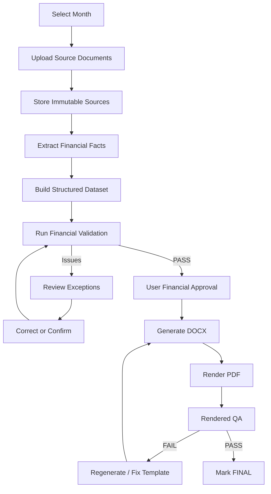
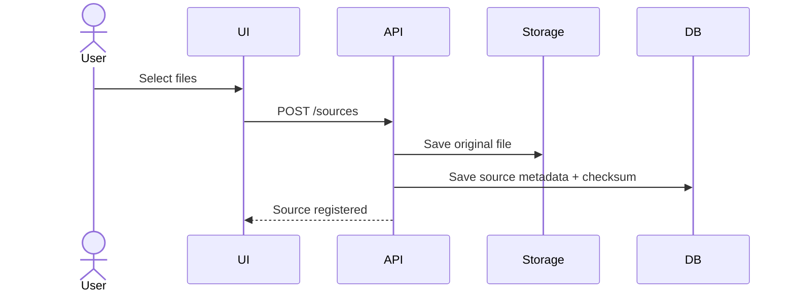
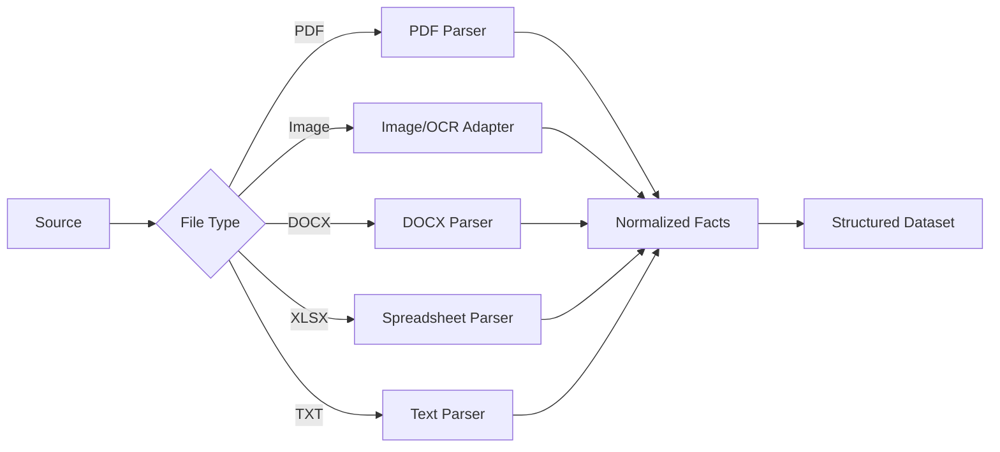
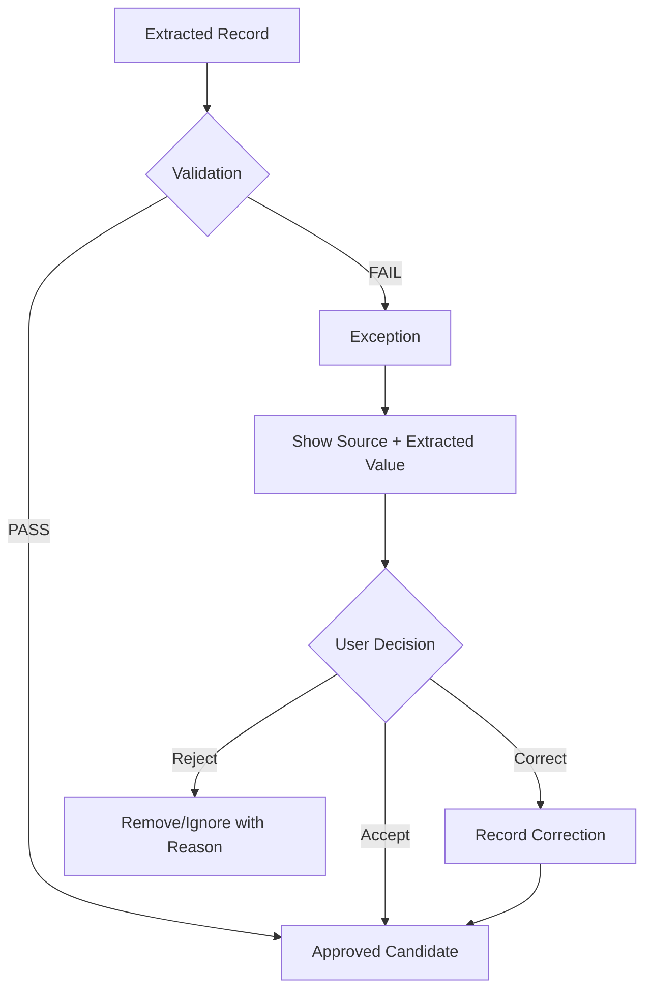
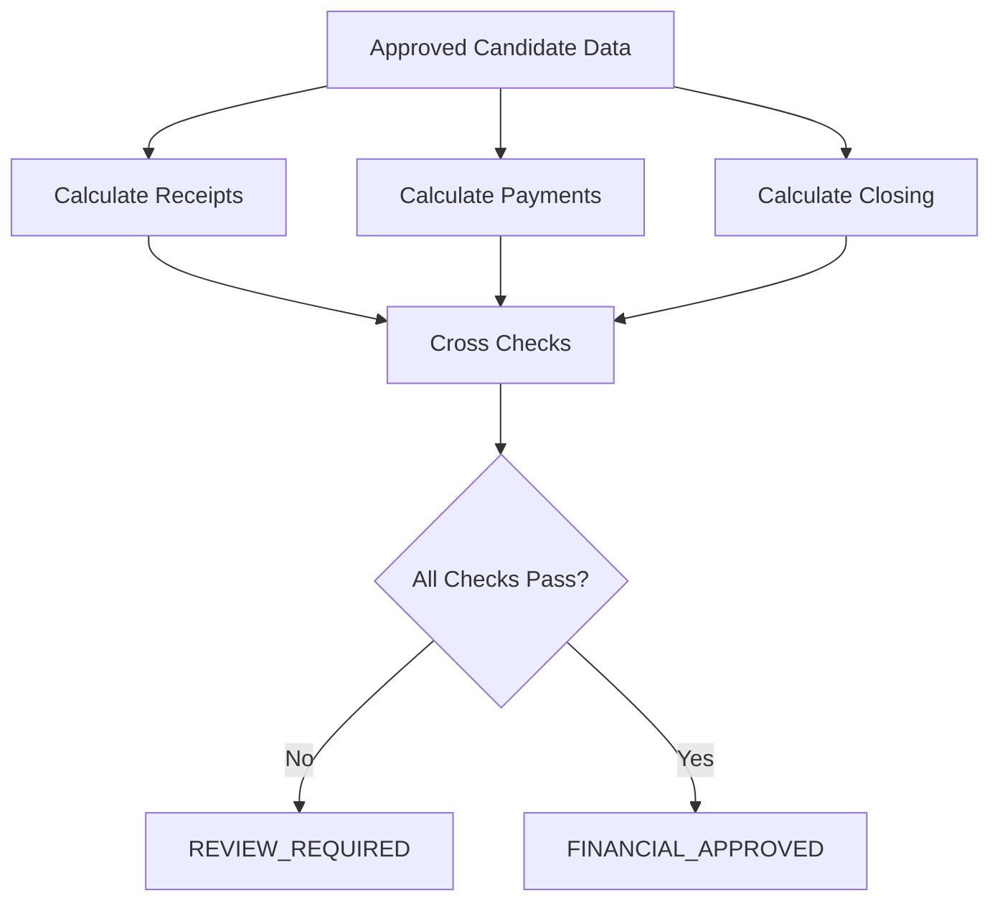
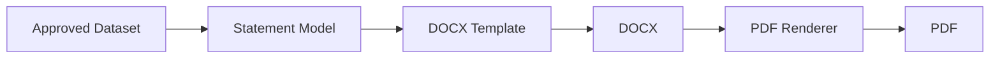
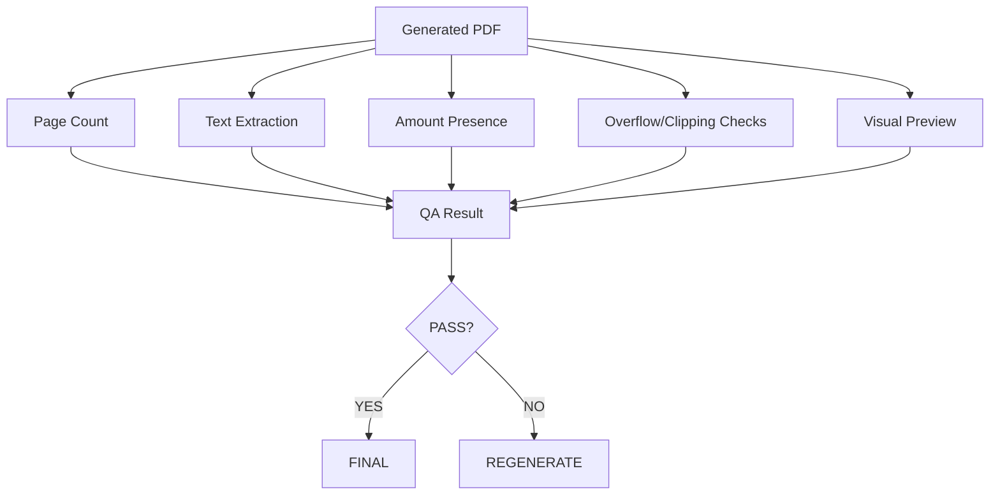
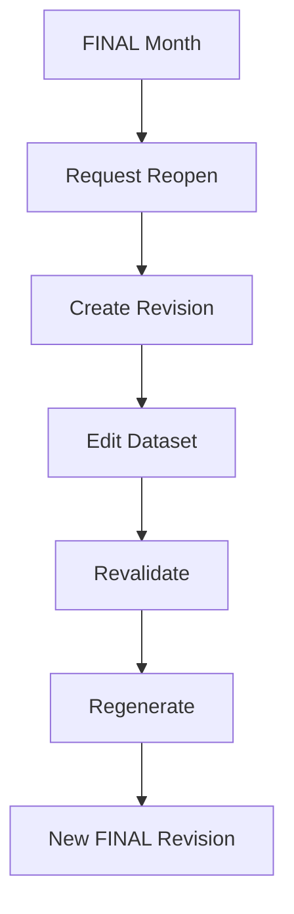

# End-to-End Flows

## Flow 1 — Create monthly statement

## Flow 2 — Upload

## Flow 3 — Extraction

## Flow 4 — Exception handling

## Flow 5 — Financial validation

## Flow 6 — Document generation

## Flow 7 — Final QA

## Flow 8 — Reopen final month

