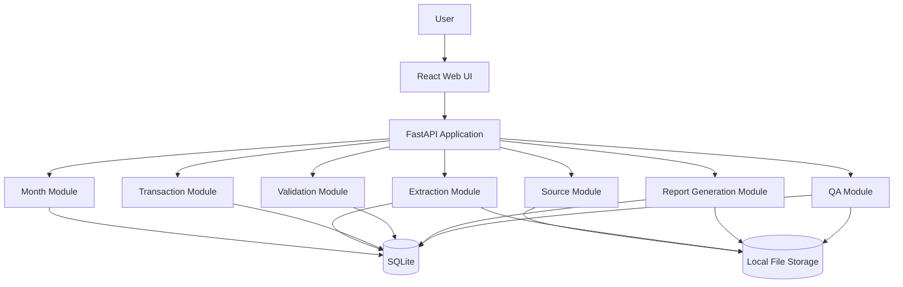

# Solution Architecture

## 1. Architectural goal

Provide a lightweight modular monolith that is easy to run, maintain, back up, and extend.

## 2. High-level architecture



## 3. Architectural inflow

```text
                USER INTENT
                    |
                    v
             MONTH WORKSPACE
                    |
                    v
              SOURCE FILES
                    |
                    v
          SOURCE REGISTRATION
                    |
                    v
              EXTRACTION
                    |
                    v
          NORMALIZED FINANCIAL
                FACTS
                    |
                    v
          STRUCTURED DATASET
                    |
                    v
          FINANCIAL VALIDATION
                    |
             +------+------+
             |             |
           FAIL           PASS
             |             |
             v             v
        EXCEPTIONS       APPROVAL
             |             |
             +------<------+
                           |
                           v
                   REPORT MODEL
                           |
                           v
                     DOCX ENGINE
                           |
                           v
                     PDF ENGINE
                           |
                           v
                      QA ENGINE
                           |
                           v
                     FINAL REPORT
```

## 4. Internal module boundaries

V1 should remain one FastAPI process but use clear modules:

```text
backend/
  app/
    api/
    domain/
      months/
      sources/
      transactions/
      validation/
      reports/
      qa/
    services/
    repositories/
    schemas/
    templates/
    config/
```

This gives logical separation without microservices.

## 5. Frontend modules

```text
frontend/
  src/
    pages/
      Dashboard
      MonthWorkspace
      Review
      Report
      History
    components/
      Upload
      TransactionTable
      ValidationSummary
      ExceptionPanel
      ReportPreview
    services/
      api
    models/
```

## 6. Local storage architecture

```text
data/
  database/
    finance.db

  sources/
    2026/
      09/
        <source-id>/
          original.pdf
          metadata.json

  reports/
    2026/
      09/
        revision-01/
          statement.docx
          statement.pdf
          qa.json

  exports/
```

## 7. Source of truth

SQLite structured data is the authoritative application dataset.

Original source files are immutable evidence.

Generated documents are derived artifacts.

## 8. Why modular monolith

The workload is small. Distributed systems would introduce unnecessary:

- networking;
- service discovery;
- operational overhead;
- failure modes;
- deployment complexity.

A modular monolith preserves clean boundaries while remaining lightweight.
