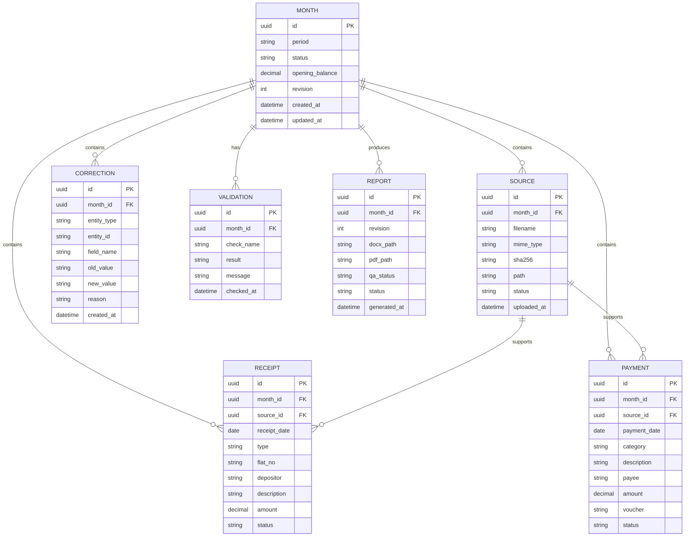

# Data Model

## Entity relationship



## Calculation model

```text
Opening Balance = explicit approved opening value

Receipts = SUM(approved receipt amounts)

Payments = SUM(approved payment amounts)

Closing Balance =
    Opening Balance
    + Receipts
    - Payments
```

## Data integrity

Use decimal/numeric database fields for currency rather than floating-point arithmetic.

Currency should be represented to two decimal places where required.

Amounts displayed in Indian Rupee format:

```text
₹59,498
₹51,207
₹8,291
```
