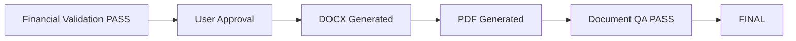

# Validation and QA Specification

## Two independent gates

### Gate A — Financial Controller

Checks data correctness only.

### Gate B — Document QA

Checks rendered document correctness only.

## Financial checks

```text
Opening balance present
Receipt amounts present
Payment amounts present
Dates valid
No unintended duplicate transactions
Receipt totals correct
Payment totals correct
Closing balance correct
Required source references present
Explicit corrections recorded
```

## Reconciliation formula

```text
Expected Closing =
Opening Balance + Total Receipts - Total Payments
```

The calculated value must equal the approved closing balance.

## Example

```text
₹998
+ ₹58,500
- ₹51,207
= ₹8,291
```

## Document QA

Check:

- DOCX exists;
- PDF exists;
- PDF opens;
- page count;
- text exists;
- all amounts are visible;
- totals appear;
- closing balance appears;
- headings are not clipped;
- tables fit page;
- notes are visible;
- no blank amount cells caused by table layout;
- no unintended blank pages.

## QA status

```text
NOT_RUN
PASS
FAIL
```

## Finalization rule



## Traceability rule

Every displayed financial value must be traceable to:

```text
Source document
       OR
Explicit user correction
       OR
Deterministic calculation
```

No unexplained number may appear in a FINAL report.
