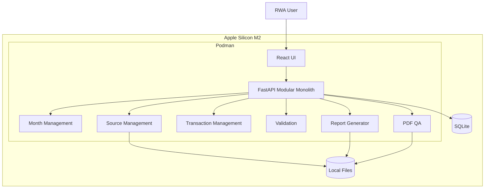

# V1 Architecture at a Glance



## Technology map

| Layer | V1 |
|---|---|
| UI | React |
| API | FastAPI |
| Language | Python |
| Database | SQLite |
| Files | Local filesystem |
| Documents | python-docx |
| PDF | Local renderer/converter |
| Runtime | Podman |
| Host | Mac M2 |
| Authentication | Local/single-user |
| Deployment | Local |
| Cloud | None |

## Extension points

```text
             V1
              |
     +--------+--------+
     |        |        |
    OCR     Bank     Analytics
     |        |        |
     +--------+--------+
              |
        Optional AI
              |
        Optional Cloud
```

The architecture remains lightweight even as capabilities are added.
