# Architecture — LMP Vrinda Finance Engine

The single source of truth for how this system is designed: the overall
architecture, system design, feature catalog, use cases, and the full C4 model
(Context → Container → Component → Code). Read top to bottom.

---

## 1. Product in one paragraph

The LMP Vrinda Finance Engine turns a RWA (apartment association) treasurer's
**monthly source scans** into a **validated, signed, one-page financial
statement** (DOCX + PDF). A scan is read by an extraction engine, the extracted
rows are reviewed/corrected by the user, totals are computed deterministically,
the dataset is approved, a statement is generated and QA-checked, and the month
is locked as FINAL (amendable only via an audited Reopen → new revision). It is
**local-first** (SQLite + local files), **single-admin** (JWT auth), and runs as
a small modular monolith behind Caddy with automatic HTTPS.

### Design principles
| Principle | Meaning |
|---|---|
| Data-first | The structured dataset is the system of record; DOCX/PDF are derived artifacts. |
| No silent correction | Every change to an extracted value is explicit and audited. |
| Deterministic money | Totals/balances are computed by code, in integer paise, never trusted from input. |
| Review gates | A month cannot go FINAL without validation PASS + user approval + QA PASS. |
| Immutable finals | A signed statement is read-only; changes require an audited Reopen → new revision. |
| Local-first & lightweight | SQLite, local files, modular monolith — no cloud DB, queue, or microservices. |
| Pluggable extraction | Two product providers (openrouter cloud / ollama local), swappable and deletable; stub is test-only. |

---

## 2. Overall architecture

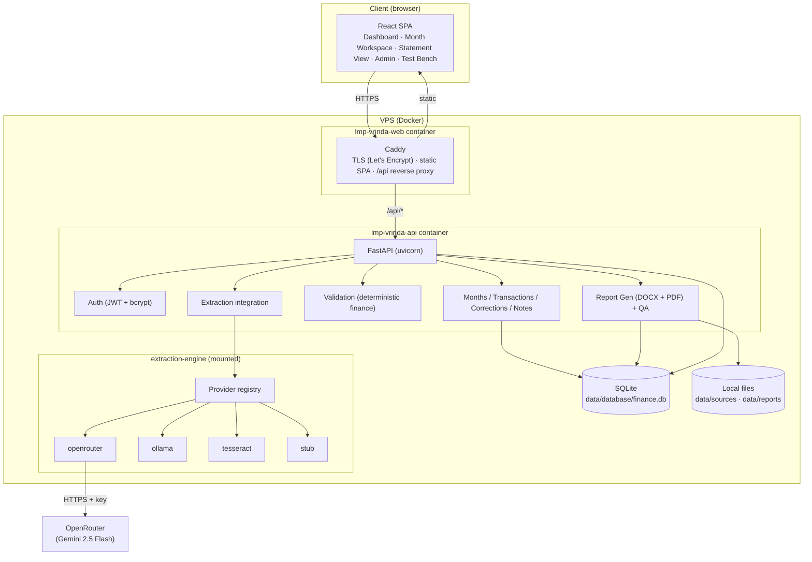

### Technology map
| Layer | Choice | Why |
|---|---|---|
| UI | React 18 + Vite | Light SPA, fast build |
| Edge | Caddy 2 | Auto HTTPS, static serve + reverse proxy in one |
| API | FastAPI (uvicorn) | Typed, async, OpenAPI |
| DB | SQLite + SQLAlchemy 2 | Zero-admin, transactional, file-backup |
| Money | Integer paise | No float error |
| DOCX | python-docx | Style-driven template |
| PDF | WeasyPrint (HTML→PDF) | Pure-python, deterministic, no office suite |
| QA | poppler (pdftotext/pdfinfo) | Verify the rendered artifact |
| Auth | PyJWT + bcrypt | Stateless token, hashed password |
| Extraction | Pluggable providers | openrouter (cloud) default; ollama/tesseract/stub |
| Runtime | Docker Compose | Two containers, host-mounted data |

---

## 3. Runtime / deployment view

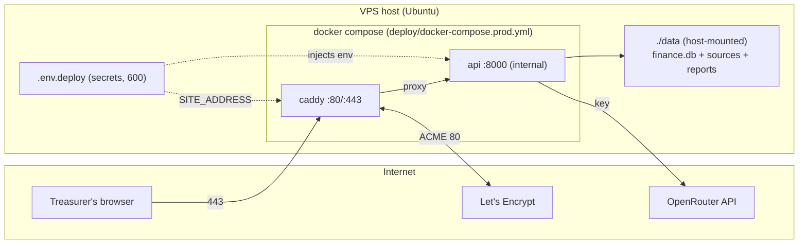

- **Only ports 80/443** are exposed; the API (8000) is internal to the compose network.
- **Data persists** on the host in `./data` — survives rebuilds; backup = copy folder.
- **Secrets** live only in `.env.deploy` (git-ignored, perms 600); the real admin
  password lives in the DB (seeded once from env).

---

## 4. Request lifecycle (a monthly statement, end to end)

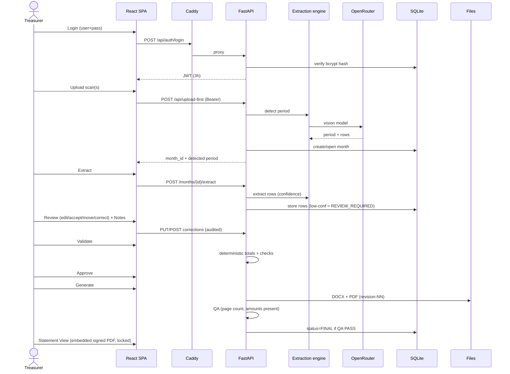

---

## 5. Feature catalog (full descriptions)

### 5.1 Monthly period management
Create/select a month (`YYYY-MM`). Lifecycle status: `DRAFT → EXTRACTED →
REVIEW_REQUIRED → FINANCIAL_APPROVED → GENERATED → FINAL → ARCHIVED`. Period is
unique. Opening balance is read from the scan, not entered manually.

### 5.2 Scan-driven entry (upload-first)
Upload one or more scans; the engine reads the **period** from the header and
auto-creates/opens that month. Manual "New Month" remains as a fallback for
scanless months.

### 5.3 Source management & immutability
Uploaded files are stored under `data/sources/<y>/<m>/<id>/` with a SHA-256
checksum and metadata. Originals are immutable evidence; "delete" is a logical
status flip, never a file removal.

### 5.4 Extraction (pluggable)
A configured provider reads a scan into structured receipt/payment rows, each
with a **confidence** score and an optional detected period/opening balance.
Rows below the threshold are marked `REVIEW_REQUIRED` and flagged in the UI.
Providers: `openrouter` (cloud, default), `ollama` (local), `tesseract` (OCR),
`stub` (offline/test). Engine is self-contained and any provider is deletable.

### 5.5 Review & correction
Inline per-row **edit / accept / remove**, plus **move between Receipts and
Payments** (button + drag-and-drop) for misfiled rows. Opening balance is
corrected explicitly with a reason. Every correction is written to an audit
`Correction` record (old value, new value, reason, timestamp).

### 5.6 Notes
Attention notes (title + body + highlight) that render in the NOTES block at the
bottom of the statement. Full add/edit/remove.

### 5.7 Deterministic validation
Totals computed in integer paise:
`Total Receipts = Opening + Σ receipts`, `Closing = Opening + Σ receipts − Σ payments`.
Checks: opening present, has transactions, amounts present, no negatives, valid
dates, no duplicates, arithmetic consistent. Result: `FINANCIAL_APPROVED` or
`REVIEW_REQUIRED`.

### 5.8 Approval & generation
Approval is gated on validation PASS. Generation builds a one-page DOCX (style
template, no clipped amounts) and a PDF (WeasyPrint), then runs QA.

### 5.9 Rendered QA
Checks the actual PDF: exists, readable, page count, single-page target, amounts
present, not empty. Month becomes FINAL only on QA PASS.

### 5.10 Statement View & immutable finals
Clicking a FINAL month shows the **embedded signed PDF** (the exact stored
artifact), locked, with QA badge, revision, and downloads. Changing it requires
**Reopen** (reason required → audited → new revision; prior revision's PDF
preserved).

### 5.11 Admin & housekeeping
Admin screen lists all months with counts; delete is allowed for non-final
months and blocked for FINAL/ARCHIVED. CLI cleanup script + `--force-period`
override for test leftovers.

### 5.12 Authentication & security
JWT (3h) + bcrypt, single admin. DB-owned password (seeded from env on first
run) with UI change-password and "sign out everywhere" (token revocation via a
`token_valid_after` line). Boot guard refuses demo/empty passwords.

### 5.13 Extraction Test Bench
A hideable developer page to run any provider against an uploaded scan ad-hoc
(no persistence) and inspect rows, confidence, and raw model output.

---

## 6. Use cases

### 6.1 Actors
| Actor | Description |
|---|---|
| **Treasurer (Admin)** | The single RWA user. Does the full monthly workflow and admin. |
| **Extraction Engine** | System actor that reads scans (delegates to a provider). |
| **OpenRouter** | External system (vision model) used by the openrouter provider. |
| **Caddy** | Edge actor: TLS, static serving, API proxy. |

### 6.2 Use-case diagram

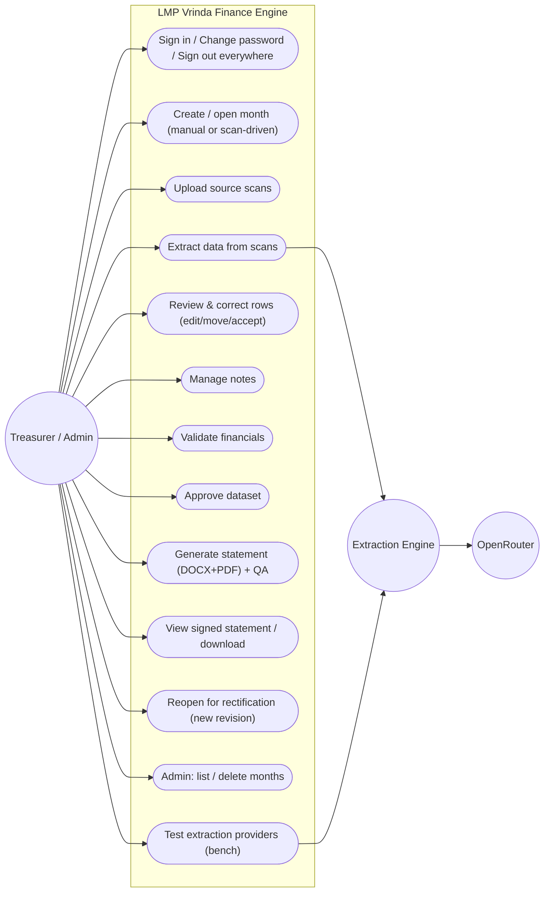

### 6.3 Primary use-case: "Produce the monthly statement"
- **Precondition:** Admin authenticated; scans available.
- **Main flow:** upload-first → extract → review/correct → notes → validate →
  approve → generate → QA PASS → FINAL → view/download.
- **Alternates:** low-confidence period → manual month; validation fails → fix &
  re-validate; QA fails → regenerate; mistake after sign-off → Reopen (reason) →
  new revision.
- **Postcondition:** an immutable, signed one-page statement with an audit trail.

### 6.4 Supporting use-case: "Rectify a signed statement"
Reopen (reason, audited) → month returns to editable at a new revision → correct
→ re-validate → re-approve → re-generate → FINAL again; the prior revision's PDF
remains downloadable.

---

## 7. C4 model

### 7.1 C4 L1 — System Context

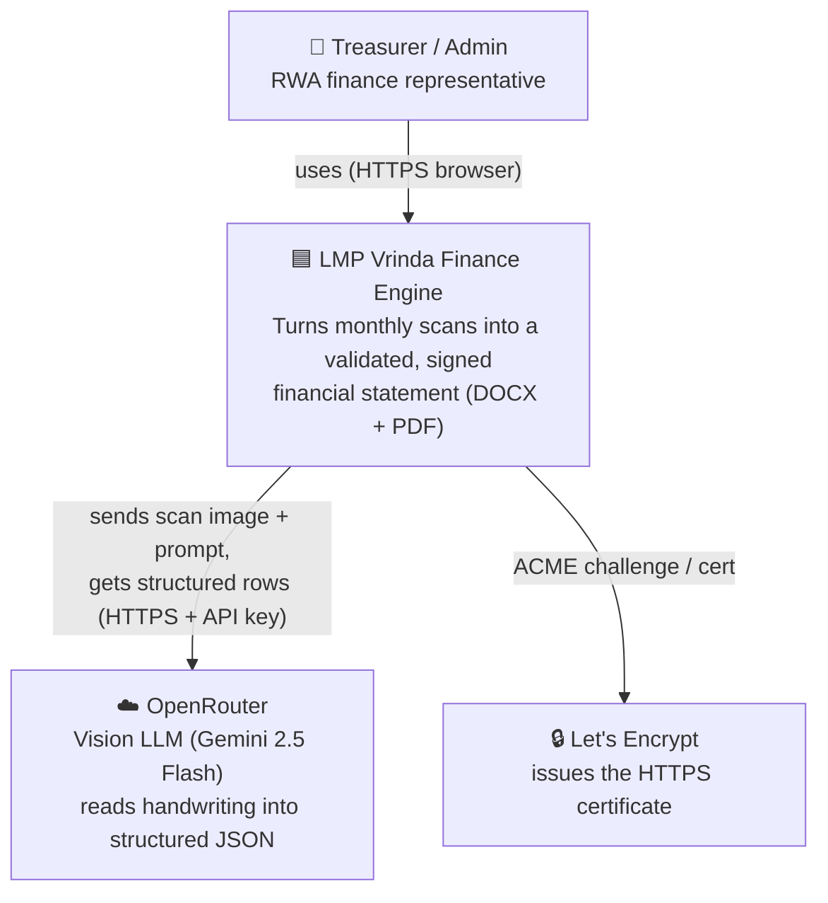

**Narrative.** A single admin uses the system through a browser. The system
depends on exactly two external parties: OpenRouter (optional, only for cloud
extraction) and Let's Encrypt (for TLS). No other external dependency — no cloud
DB, queue, analytics, or third-party auth.

### 7.2 C4 L2 — Containers

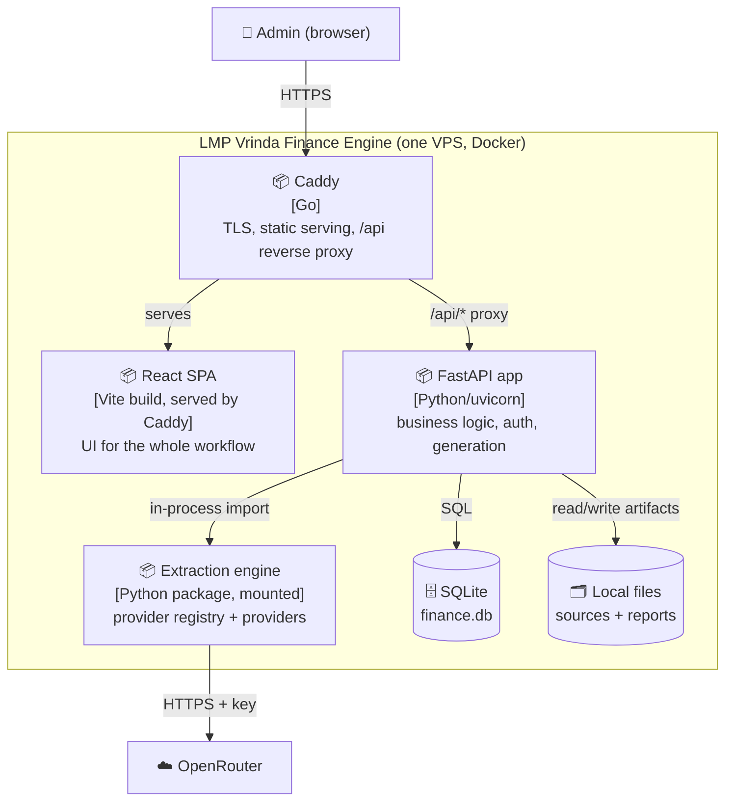

**Container responsibilities.**
- **React SPA** — all screens; stores JWT; attaches `Authorization: Bearer`.
- **Caddy** — single edge: TLS termination (auto cert), static SPA host,
  reverse proxy of `/api/*` with long timeouts for slow vision calls.
- **FastAPI app** — auth, months/transactions/corrections/notes, deterministic
  validation, DOCX/PDF generation, QA, and the extraction integration.
- **Extraction engine** — self-contained package (mounted read-only); registry
  loads providers defensively; each provider lazy-imports its deps.
- **SQLite** — the system of record (months, rows, corrections, validations,
  reports, app_state). **Files** — immutable source scans + generated artifacts.

### 7.3 C4 L3 — Components (inside the FastAPI container)

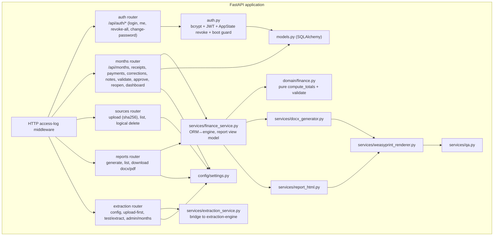

**Key component rules.**
- `domain/finance.py` is **pure** (no DB/web/render imports) → unit-testable in isolation.
- `services/*` bridge the pure domain and ORM to the web layer.
- `extraction_service.py` guards the engine import — the app still boots if the
  engine folder is removed.
- Routers are thin; business rules live in services/domain.

### 7.4 C4 L4 — Code (the extraction engine, deletability by design)

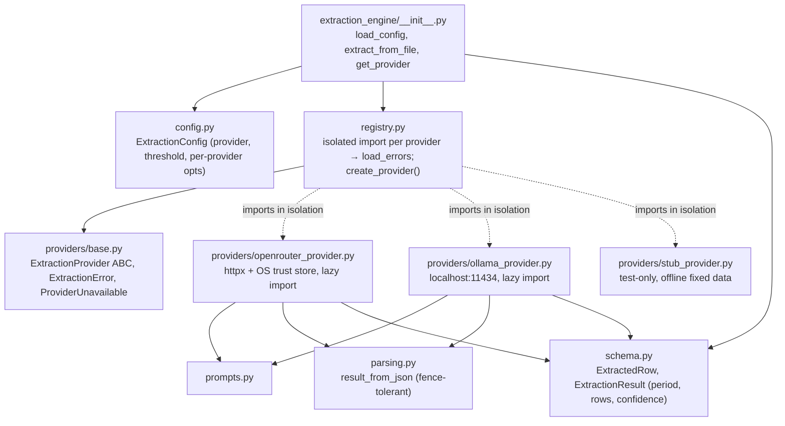

**Why this shape.** The registry imports each provider in its own try/except, so
a missing provider file or an absent optional dependency never breaks the others
or the app. Switching providers is a one-line `config.yaml` / env change.

---

## 8. Data model

```mermaid
erDiagram
    MONTH ||--o{ SOURCE : has
    MONTH ||--o{ RECEIPT : has
    MONTH ||--o{ PAYMENT : has
    MONTH ||--o{ CORRECTION : audits
    MONTH ||--o{ VALIDATION : records
    MONTH ||--o{ NOTE : has
    MONTH ||--o{ REPORT : produces

    MONTH {
      str id PK
      str period "YYYY-MM, unique"
      str status "DRAFT..FINAL..ARCHIVED"
      int opening_balance "paise"
      int revision
      datetime approved_at
    }
    SOURCE {
      str id PK
      str filename
      str sha256
      str path
      str status "STORED|IGNORED"
      int size_bytes
    }
    RECEIPT {
      str id PK
      date receipt_date
      str description
      int amount "paise"
      str status "APPROVED|REVIEW_REQUIRED|REJECTED"
      float confidence
    }
    PAYMENT {
      str id PK
      date payment_date
      str description
      str voucher
      int amount "paise"
      str status
      float confidence
    }
    CORRECTION {
      str id PK
      str entity_type "month|receipt|payment"
      str field_name
      str old_value
      str new_value
      str reason
      datetime created_at
    }
    NOTE { str id PK; str title; str body; bool highlight; int sort_order }
    VALIDATION { str id PK; str check_name; str result; str message }
    REPORT {
      str id PK
      int revision
      str docx_path
      str pdf_path
      str qa_status "NOT_RUN|PASS|FAIL"
      str status
    }
    APPSTATE {
      int id PK "singleton row"
      str password_hash "bcrypt, DB-owned"
      datetime token_valid_after "revocation line"
    }
```

**Notes.**
- Currency is **integer paise** everywhere in the DB; rupee strings are a display concern.
- `CORRECTION` is the audit spine — opening-balance fixes, per-row edits, and
  Reopen events all land here.
- `APPSTATE` is a single row holding the mutable auth state (password + revoke line).
- Reports are keyed by `revision`; each revision writes to its own
  `data/reports/<y>/<m>/revision-NN/` folder, so prior signed PDFs are never
  overwritten.

---

## 9. Key sequences

### 9.1 Auth, token revocation, change-password

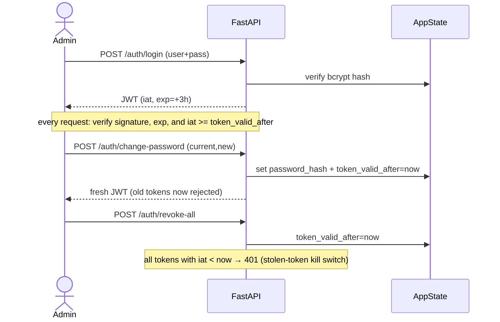

### 9.2 Immutable finalize + reopen

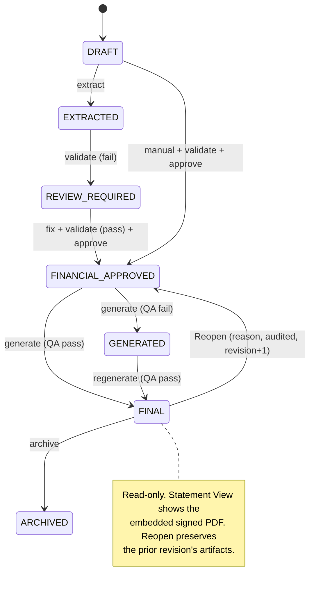

---

## 10. Environment policy (DEV vs PROD) & extraction providers

The system behaves differently by `APP_ENV`, enforced at **both** the API and UI
so production cannot be driven into an unsupported configuration.

There are **two product extraction providers**: `openrouter` (cloud) and
`ollama` (local). `stub` exists only for the offline test suite and is never a
product provider (not in `allowed_providers`, not shown in the UI). `tesseract`
has been removed.

| Aspect | DEV / local | PROD |
|---|---|---|
| Allowed providers | `ollama`, `openrouter` | **`openrouter` only** |
| Default provider | **ollama** (local-first) | **openrouter** |
| Test Bench dropdown | ollama + openrouter | openrouter only |
| API behavior for a disallowed provider | n/a (both allowed) | **refuses (409)** |
| Auth | can be disabled for local dev | always enabled |

**Rationale.** In production the only provider that is reliable, hosted, and
operationally supported is OpenRouter. Ollama is the free, private, local-first
option for development (needs the Ollama server + `qwen2.5vl:7b` model + RAM).
The lockdown is enforced server-side (the API refuses a disallowed provider with
409 in PROD) and reflected in the UI (`/config.allowed_providers`).

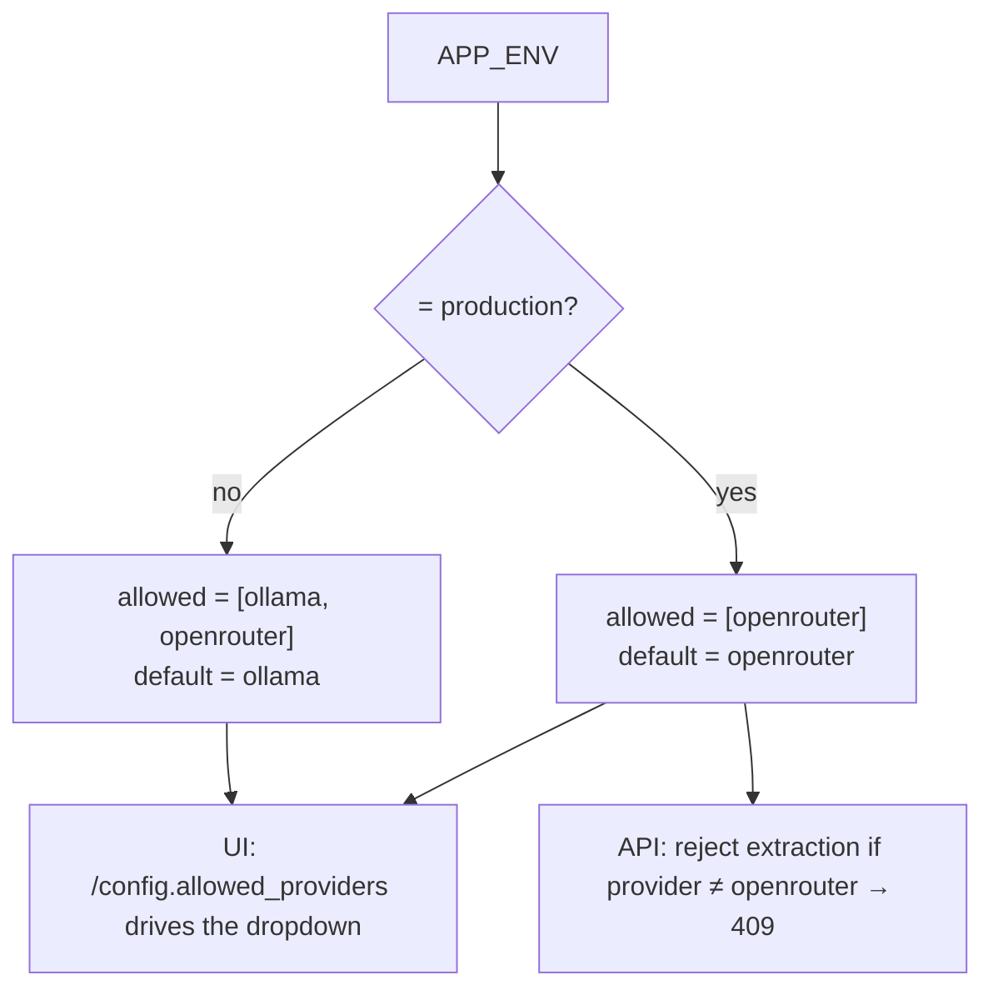

`deploy.sh` captures `APP_ENV` at deploy time and writes it to `.env.deploy`;
production deployments therefore come up locked to OpenRouter by construction.

---

## 11. Cross-references
- Deployment & operations: `deploy/README.md`
- Layer-by-layer troubleshooting: `docs/DEBUGGING.md`
- Extraction engine internals & config: `extraction-engine/README.md`
- Original product/spec pack: `docs/00..17`
